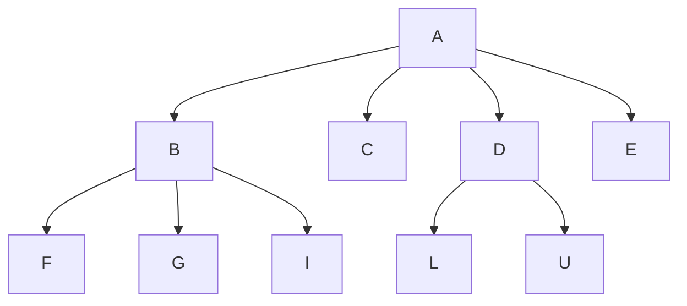
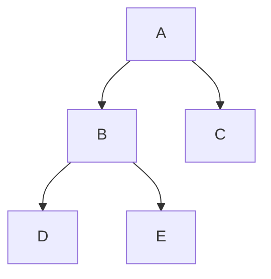

# Tree properties
Tree is a data structure where all nodes point to a multiple noodes known as the *child* nodes. Which makes the given node a *parent* of all nodes it points to.

### Tree terminologies
**Root node** : The node with no parent.\
**Height of a node** : Maximum number of edges from the node to the farther leaf node.\
**Height of a tree** : Maximum number of edges from root to a leaf.\
**Levels in a tree** : Set of nodes in a tree having same height is called a level.\
**Leaf nodes** : All nodes with 0 children.

## Binary Tree
Tree with all nodes having at max 2 child nodes. 

1. Maximum nodes in a level $l$ of a binary tree is  $2^{l-1}$.
2. Maximum nodes in a subtree of a node with height $k$ is $2^{k+1}-1$.
3. Maximum nodes in a binary tree of height $h$ is $2^{h+1}-1$.
4. Levels $l$ is a binary tree of height $h$ are $h-1$.
5. Minimum levels in a binary tree with $n$ nodes in $log_2{(n+1)}$, minimum height of a binary tree is $log_2({n+1}) - 1$.
6. Maximum number of leaf nodes in a binary tree are $2^h$ given $h$ is the height of the binary tree or  $2^{l-1}$ given the tree has $l$ levels.
7. Minimum levels in a binary tree with $N_L$ number of leaf nodes in $log_2N_L+1$

## Strict Binary tree
Binary tree with all nodes having either 0 or exactly 2 nodes

## Complete binary tree
Binary tree with all the leaf nodes at the last or second last level with all the nodes in the last level being on the left side of the tree.

## Full binary tree
Binray tree with all levels having maximum possible nodes. Such a tree has nodes with exactly 2 children and leaf nodes at the same level.