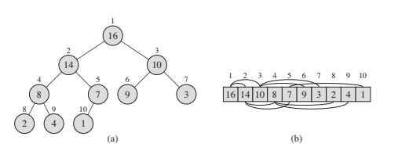

# Heaps, Priority queues and Heapsort

# Heaps
Heaps data structures are complete binary trees that makes it apt to be implemented as arrays.

Image source: Introduction to algorithms. Cormen Et, al

## Aranging heap elements in the array
For a given index i in a 0 indexed array, it's parent and children nodes can be retrieved as follows

- Parent(i) = i//2
- leftChild(i) = 2*i + 1
- rightChild(i) = 2*i + 2

## Types of binary heaps
All the nodes in the heap should satisfy the heap property specified by the following types of heap

##### Max heap
- **MaxHeap Property** : For a given node its value is less than or equal to it's parent.
  
 arr[Parent(i)] >= arr[i] 

- For a given node all nodes in the subtree have values at most it's value
- The largest value in the heap is situated at the root
- Max heap is generally used in HeapSort applications
##### Min heap
- **MinHeap Property** : For a give node its value is greater than or equal to it's parent.
  
 arr[Parent(i)] <= arr[i] 

- For a given node all nodes in the subtree have values at min it's value
- The smallest value in the heap is present at the root
- Min heap is generally used in priority queue applications

## Heap operations
### Maintaining the heap property
**max_heapify** : In a max heap, function to main the MaxHeap Property. If the given node has value less than it's children then the procedure identifies the child node with largest value and swaps the value of the given node. The max_heapify is then recursively called on the sub trees with the swapped value. max_heapify percolates the values from top to bottom.

    max_heapify(arr, i):
        l_i = 2*i+1
        r_i = 2*i+2
        largest = i

        if l_i <= len(arr)-1 and arr[l_i] > arr[largest]:
            largest = l_i
        elif r_i <= len(arr)-1 and arr[r_i] > arr[largest]:
            largest = r_i            

        if largest != i:
            swap(arr[i], arr[largest])
            max_heapify(arr, largest)

*Runtime analysis of max_heapify* \
In the worst case the heapyify function will traverse through from root to bottom leaf node across the levels in the heap. For a heap with number of nodes = n, total levels in the trees = $logn$.
Runtime will be in the order of $O(logn)$

**Building the heap** : A heap is built by calling the max_heapify on elements as they are entered into the array in a bottom up fashion i.e starting from the leaf nodes. At each step the *MaxHEap Property* is to be maintained. Since we insert the leaf nodes first, and all leaf nodes fullfil the *MaxHeap Property* by default. Hence the max_heapify procedure is called for the internal nodes instead. As per the peroperty of complete binary tree, $N_i = (N-1)/2$

    build_max_heap(arr):
        N = len(arr)
        for i in range(N/2, 0, -1):
            max_heapify(arr, i)
            
*Runtime analysis of build_max_heap* \
<ins>Upper bound analysis</ins> : The procedure calls max_heapify n/2 times which takes $logn$ in itself to run. Hence, the upper bound is $O(nlogn)$.\

<ins>Assympototically tight analysis</ins> : If we observe carefully the max_heapify takes O(logn) or O(h). The height of the tree is changing for each node. h=0 for all leaf nodes, h = 1 for all nodes one level up, h = 2 for all nodes before and so on. Given the number of leaf nodes in a tree is $(N+1)/2$, the runtime can be expanded as follows 

    $(N+1)/2*0 + (N+1)/2^2*1 + (N+1)/2^3*2 + ... + 1$
    $$\left(\sum_{0}^{logn} N/(2^i))$$

# Priority Queueus

# Heap sort

##### Ref: CLRS
